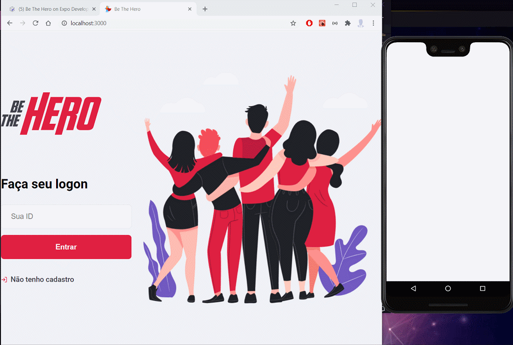

<h1 align="center">Omnistack 11.0</h1>

 
   

<h2>📖 About</h2>

The Be The Hero project was developed to connect NGOs and other institutions to people available to help others.

------------

<h2>🔖 Layout</h2>

💻 Check the Web layout on <a href="https://www.figma.com/file/2C2yvw7jsCOGmaNUDftX9n/Be-The-Hero---OmniStack-11?node-id=0%3A1">Figma</a>.

📱 &nbsp; Check the Mobile layout on <a href="https://www.figma.com/file/2C2yvw7jsCOGmaNUDftX9n/Be-The-Hero---OmniStack-11?node-id=37%3A95">Figma</a>.

------------

<h2>🚀 Technologies</h2>

This project was developed with:
- [NodeJs](https://nodejs.org/en/ "NodeJs")
- [Express](https://expressjs.com/ "Express")
- [Expo-Cli](https://expo.io/tools#cli "Expo-Cli")
- [React](https://reactjs.org/ "React")
- [React Native](https://reactnative.dev/ "React Native")

------------

<h3>Dependencies</h3>

- [Express](https://expressjs.com/ "Express")
- [KnexJS](http://knexjs.org/ "KnexJS")
- [SQLite3](https://www.npmjs.com/package/sqlite3 "SQLite3")
- [Axios](https://www.npmjs.com/package/axios "Axios")
- [Celebrate](https://www.npmjs.com/package/celebrate "Celebrate")
- [Jest](https://jestjs.io/)
- [Cross-env](https://www.npmjs.com/package/cross-env)
- [Supertest](https://www.npmjs.com/package/supertest)
  

------------

<h2>♻️ How to Contribute</h2>

- Fork this repository;

- Make a branch with your feature: `git checkout -b my-feature`

- Commit your changes: `git commit -m 'feat: My new feature'`

- Push your branch: `git push origin my-feature`

------------

<h2>🎓 Developed by</h2>
Be The Hero was developed by <a href="https://github.com/diego3g">Diego Fernandes</a> from <a href="https://rocketseat.com.br/">Rocketseat</a>

------------

<h2>📃License</h2>

This project is under MIT License. Access  <a href="https://github.com/Nandosbx/be-the-hero/blob/master/LICENSE.md">Licença</a> and learn more.

------------

<footer align="center">
 <strong align="center">Made with 💜 by Fernando Batista</strong>
</footer>